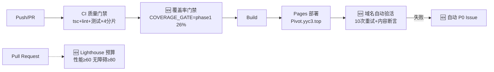

# 📋 三大运维工作项任务规划（域名验活 · Lighthouse · 覆盖率门禁）

> **执行总则**: 执行有规划，规划有节点，节点有目标，目标可评估

---

## 一、总体目标

在 CI/CD 全链路闭环落地三项自动化运维机制，实现「部署可验证、性能有预算、质量只升不降」：

---

## 二、阶段划分与总览

| 阶段 | 名称 | 目标 | 交付物 | 状态 |
|:-----|:-----|:-----|:--------|:-----|
| Phase 1 | 机制落地 | 三项机制代码全部合入 main | deploy.yml / lighthouserc.json / vitest.config.ts / ci.yml | ✅ 已完成 |
| Phase 2 | 运行观察 | 首次线上流水线跑通 | GitHub Actions 运行记录 + 域名验活通过日志 | 🔄 待推送后验证 |
| Phase 3 | 阈值推进 | 覆盖率 phase1→phase2，Lighthouse 预算收紧 | vitest.config.ts gate 更新 PR | ⬜ |

---

## 三、详细任务分解

### Task 1.{1-4}: 部署后域名自动验活

**目标**: 部署完成后 60 秒内自动确认 Pivot.yyc3.top 可用性
**验收标准**:
- [x] 部署成功后自动发起探活（无需人工触发）
- [x] 成功标准 = HTTPS 200 + 响应体含品牌标识 "YYC" + 单次超时 15s
- [x] 失败自动重试 10 次（指数退避 10s→100s）
- [x] 10 次均失败 → 自动创建 P0 Issue（含 DNS/Pages/CNAME 三步排查流程）+ 留存诊断产物
- [x] 本地实测目标域名 200 ✅（2026-09-16）

| 属性 | 值 |
|:-----|:---|
| 实施位置 | [.github/workflows/deploy.yml](file:///Users/yanyu/YYC-Cube/YYC3-CloudPivot-Intelli-Matrix/.github/workflows/deploy.yml) `verify-domain` + `alert-on-failure` job |
| 负责人 | CI 维护者（AI 导师实施，owner 复核） |
| 时间节点 | 2026-09-16 完成 → 首次线上验证于合入后首个 deploy run |
| 风险 | GitHub Pages 部署最终生效有延迟 → 已由 10 次退避重试覆盖 |

### Task 2.{1-3}: Lighthouse 性能预算

**目标**: PR 级性能回归自动阻断 + 报告可视化
**验收标准**:
- [x] lighthouserc.json 预算定义（初始宽松，渐进收紧）
- [x] CI 集成（PR + 手动触发），超标 exit 1 阻断合并
- [x] HTML 报告 artifact 留存 14 天
- [ ] 首次线上运行采集真实指标后回调预算（P1，合入后一周内）

| 预算项 | 阈值 | 级别 | 收紧路线 |
|:-------|:-----|:-----|:---------|
| Performance | ≥ 60 分 | **error 阻断** | phase2: 70 → phase3: 80 |
| Accessibility | ≥ 80 分 | **error 阻断** | phase2: 85 → phase3: 90 |
| Best Practices | ≥ 70 分 | warn | phase2 升级为 error |
| JS 体积 | ≤ 700KB | **error 阻断** | phase2: 600 → phase3: 500 |
| CSS 体积 | ≤ 150KB | **error 阻断** | 保持 |
| LCP / CLS / TBT | 4s / 0.25 / 2s | warn | phase2 收紧至 3.5s/0.1/1.5s |

| 属性 | 值 |
|:-----|:---|
| 实施位置 | [lighthouserc.json](file:///Users/yanyu/YYC-Cube/YYC3-CloudPivot-Intelli-Matrix/lighthouserc.json) + ci.yml `lighthouse` job |
| 负责人 | 前端负责人 + CI 维护者 |
| 时间节点 | 2026-09-16 机制落地；预算回调 2026-09-23 前 |
| 设计取舍 | PWA/SEO 类断言 off（本项目为 Electron+Web 混合形态，避免误报） |

### Task 3.{1-3}: 覆盖率门禁渐进抬升

**目标**: Lines 27% → 45% → 60% → 80%，只升不降
**验收标准**:
- [x] 现状分析: 全量 2023 用例通过，Lines 27.33%（lcov 实测）
- [x] 门禁机制: `COVERAGE_GATE` 环境变量驱动，CI 强制 phase1，本地宽松基线不影响开发
- [x] CI `coverage-gate` job 全量单跑强制校验
- [ ] Phase 1→2 推进（2026-10-01 前，责任人: 前端负责人）
- [ ] Phase 2→3 推进（2026-11-01 前，责任人: 前端负责人 + AI 导师）

| 阶段 | Lines | Functions | Branches | 时间节点 | 责任人 |
|:-----|:-----:|:---------:|:--------:|:---------|:-------|
| phase1（已启用）| 26 | 23 | 25 | 2026-09-16 ✅ | CI 维护者 |
| phase2 | 45 | 40 | 35 | 2026-10-01 | 前端负责人 |
| phase3 | 60 | 55 | 50 | 2026-11-01 | 前端+AI 导师 |
| final | 80 | 75 | 70 | 2027-Q1 | 全团队 |

**提升路径**（详见证[覆盖率与CI优化报告](./CPIM-测试覆盖率与CI优化报告-20260916.md)）:
1. P0: `lib/db-queries` + GlobalStore 新架构补测（成本最低收益最高）
2. P1: `useHostFileSystem`(0%) / `useBigModelSDK`(1%) 等 Hooks 收编
3. P2: `ai-family` / `ide` 组件域攻坚

---

## 四、里程碑节点

| 节点 | 计划时间 | 实际时间 | 状态 |
|:-----|:---------|:---------|:-----|
| M1: 三机制代码合入 | 2026-09-16 | 2026-09-16 | ✅ |
| M2: 首次线上全链路验证 | 合入后首个 push | — | ⬜ |
| M3: Lighthouse 预算回调 | 2026-09-23 | — | ⬜ |
| M4: 覆盖率 phase2 切换 | 2026-10-01 | — | ⬜ |

## 五、变更记录

| 日期 | 变更内容 | 原因 |
|:-----|:---------|:-----|
| 2026-09-16 | 初始规划 + Phase 1 全部落地 | 用户需求：三项运维机制实施与文档同步 |

## 六、会话收尾检查

- [x] 配置语法校验通过（yaml×3 + json）
- [x] phase1 门禁下全量测试 2023/2023 通过
- [x] CHANGELOG.md 已更新
- [x] 本文档（任务规划）已创建
- [ ] CI 专项变更 + 文档提交推送（并行执行中）
- [ ] 推送后确认 GitHub Actions 首次运行状态
