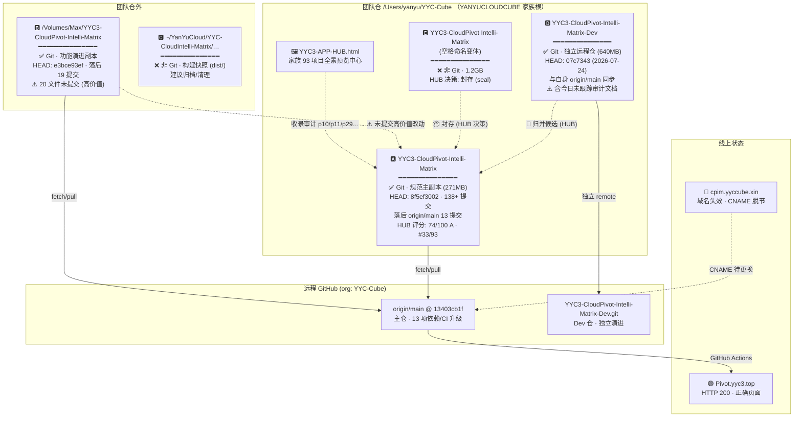
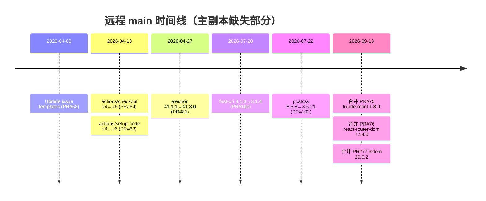
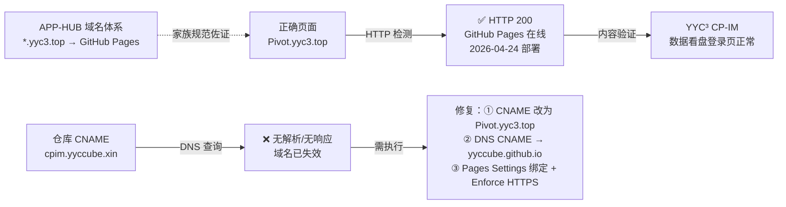
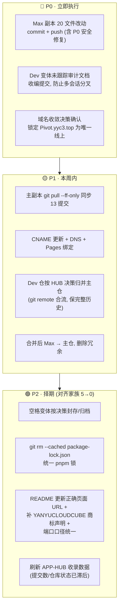

# 📊 CPIM 五副本深度对比分析报告（v2.0 · 结合团队仓与 APP-HUB 全景）

> **项目名称**： `YYC3-CloudPivot-Intelli-Matrix`
> **团队注册商标**： `YANYUCLOUDCUBE`
> **团队本地仓**： `/Users/yanyu/YYC-Cube`（YYC³ 家族 30+ 项目统一托管根目录）
> **团队项目预览**： [`YYC3-APP-HUB.html`](file:///Users/yanyu/YYC-Cube/YYC3-APP-HUB.html)（家族 93 项目全景分析中心）
> **远程仓库**： `https://github.com/YYC-Cube/YYC3-CloudPivot-Intelli-Matrix.git`
> **Pages 正确页面**： `Pivot.yyc3.top` ✅ 在线 (HTTP 200 · server: GitHub.com · 2026-04-24 部署)
> **仓库 CNAME 现状**： `cpim.yyccube.xin` 🔴 **已失效**（无响应，与正确页面脱节）
> **审计日期**： 2026-09-16 · **版本**： v2.0.0（整合 APP-HUB 家族审计数据后扩充）

---

## 〇、v2.0 增补摘要（相对 v1.0）

| # | 新发现 | 影响 |
| :-- | :------- | :----- |
| 1 | 团队仓内另存在 **Dev 变体**（`-Dev` 后缀，独立远程仓 `-Dev.git`） | 实际副本数 3 → **5**；HUB 标记「重复变体组 · 归并候选」 |
| 2 | 团队仓内另存在**空格命名变体**（`YYC3-CloudPivot Intelli-Matrix`，1.2GB 非 Git） | HUB 决策已定：**封存** |
| 3 | APP-HUB 家族审计佐证：「**CloudPivot ×3 内容不同步**」+ 未版本化清零目标（5→0） | 与本审计完全吻合，处置路径已有家族级依据 |
| 4 | Dev 变体内出现**今日生成的未跟踪审计文档**（`docs/audit-20260916/` 等） | 疑似另一 AI 会话并行产出，需收编防分叉 |
| 5 | HUB 记录主仓五维评分 **74/100 (A) · 家族排名 #33/93** | 主仓为家族高价值资产，域名收敛优先级上调 |

---

## 一、本机五副本全景图



### 1.1 五副本关键属性对比

| 维度 | 🅰️ 主副本 | 🅱️ Max | 🅲 快照 | 🅳 Dev 变体 | 🅴 空格变体 |
| :----- | :--------- | :------- | :------- | :---------- | :----------- |
| **路径** | `~/YYC-Cube/YYC3-…-Matrix` | `/Volumes/Max/YYC3-…-Matrix` | `~/YanYuCloud/…/YYC3-…-Matrix` | `~/YYC-Cube/YYC3-…-Matrix-Dev` | `~/YYC-Cube/YYC3-CloudPivot Intelli-Matrix` |
| **Git** | ✅ | ✅ | ❌ | ✅ | ❌ |
| **远程** | 主仓 origin | 主仓 origin | — | **独立 `-Dev.git`** | — |
| **HEAD** | `8f5ef3002` | `e3bce93ef` | — | `07c7343` (07-24) | — |
| **落后远程** | 13 | 19 | — | 0（自仓同步） | — |
| **未提交改动** | 1 文件 | **20 文件 🔴** | — | 2 项未跟踪审计文档 | — |
| **体积** | 271MB | — | — | 640MB | 1.2GB |
| **HUB 定性** | 正主（74/A/#33） | 功能金矿 | 过时快照 | 归并候选 | 封存对象 |
| **角色判定** | **唯一真源** | 抢救后合并 | 归档清理 | **保历史合流** | 按决策封存 |

---

## 二、与远程的差异明细

### 2.1 主仓远程领先内容（origin/main 独有 13 提交）



**影响文件**（7 个，+167/−83）：`package.json`、`pnpm-lock.yaml`、`package-lock.json`、`.github/workflows/deploy.yml`、3 个 Issue 模板。
**性质**：全部为 **Dependabot 安全性/维护性升级 + 模板新增**，无破坏性变更，可安全快进。

### 2.2 🅱️ Max 版本独有未提交改动（20 文件）—— 高价值 ⚠️

| 类别 | 文件 | 内容 |
| :----- | :----- | :----- |
| **架构级功能** | `src/app/App.tsx`、`src/app/contexts/GlobalStoreContext` 等 | **GlobalStoreRegistry 全局统一数据管理架构**：单例注册中心 + BroadcastChannel 跨标签页同步 + 自动迁移 |
| **功能面板** | Sidebar / MusicSpacePage / useModelProvider 等 | 统一设置管理面板（模型/Ollama/数据库/告警/巡查 5 类 CRUD + 导入导出） |
| **安全加固 P0** | `supabaseClient.ts`、`vitest.config.ts`、`chart.tsx` | 移除硬编码密码、测试密钥环境变量化、`dangerouslySetInnerHTML` HTML 消毒 |
| **质量治理** | 13 处 `console.log` 清理、any 类型修复、2023 测试全通过 | CHANGELOG/SECURITY 已详尽记录 |
| **文档** | `CHANGELOG.md` +36、`SECURITY.md` +29、`README.md` 表格全角空格化 | v1.0.0 发布前终极审查记录 |

> 🔴 **风险定性**：这批改动包含 **P0 级安全修复**（硬编码密码移除），仅存在于 `/Volumes/Max` 工作区，**未提交、未推送** —— 一旦该卷数据异常即永久丢失。

### 2.3 🅳 Dev 变体：独立远程仓 + 并行审计活动 🆕

| 检测项 | 结果 |
| :------- | :----- |
| 远程地址 | `git@github.com:YYC-Cube/YYC3-CloudPivot-Intelli-Matrix-Dev.git`（**独立仓库，非主仓分支**） |
| HEAD | `07c7343` 2026-07-24 「修整README文档」，与自身 origin/main 同步 |
| 目录结构 | 与主仓**不同构**（`AIAssistant/ api/ apps/ e2e/` — 疑为 Next.js 多应用单体） |
| 未跟踪文件 | `docs/YYC3-实况审计与落地指导-20260916.md`、`docs/audit-20260916/` —— **与本报告同日生成** ⚠️ |
| HUB 定性 | 1,123 文件 · 「与主仓构成重复变体组，属归并候选」，建议「保历史 git remote 合流」 |

> ⚠️ **并行会话警告**：Dev 变体内出现与本次审计同日的文档产出，表明存在**多 AI 会话并行工作**。按 YYC³ 协同规范，各会话应通过总结文档衔接，归并前需先收编这批审计资产，避免结论分叉。

### 2.4 CNAME 与域名一致性审计 🔴



| 检测项 | 结果 | 说明 |
| :------- | :----- | :----- |
| `pivot.yyc3.top` 解析+HTTPS | ✅ 200 | `server: GitHub.com`，Pages 正常服务 |
| `cpim.yyccube.xin` 解析+HTTPS | 🔴 无响应 | 仓库内 CNAME 与正确页面**脱节** |
| CNAME 文件（各 Git 副本） | `cpim.yyccube.xin` | 若 Pages 重部署将触发自定义域校验失败 |
| HUB 域名验活配方 | `for h in …; do curl -sI https://$h` | 家族已内置域名巡检机制，应纳入本仓 CI |

---

## 三、团队仓与 APP-HUB 交叉验证

### 3.1 家族全景中的 CPIM（源自 [YYC3-APP-HUB.html](file:///Users/yanyu/YYC-Cube/YYC3-APP-HUB.html)）

| HUB 条目 | 收录数据 | 与本审计实测对照 |
| :--------- | :--------- | :---------------- |
| p10 主仓 | 1,525 文件 · 271.62MB · 138 提交 · MD×726/TSX×292/TS×215 · Radix 技术栈 | ✅ 与实测一致（HEAD 提交数已增长） |
| p10 五维评分 | T4·U5·C3·M2·B4 → **74/100 · A · #33/93** | 主仓为家族高价值资产 ✅ |
| Dev 变体条目 | 「重复变体组 · 归并候选 · 保历史合流」 | ✅ 实测确认为独立远程仓 |
| 空格变体条目 | 2,216 文件 · 169.7MB · 非 Git · 归并候选 | ✅ 实测 1.2GB 非 Git |
| 家族级风险清单 | 「**CloudPivot ×3 内容不同步**」 | ✅ 本审计证实为 ×5（含团队仓外 2 副本） |
| 纳管决策 0.3 | 「CloudPivot 空格版封存」「未版本化 5 → 0」 | ✅ 处置路径与家族决策一致 |
| CI/CD 路线 | org 全量 GitHub · 179 workflow · `*.yyc3.top` 域名映射 Pages | ✅ `Pivot.yyc3.top` 正确页面即此体系产物 |

### 3.2 全局文档 vs 开发者文档一致性审核

| 审核项 | 状态 | 依据 |
| :------- | :----- | :----- |
| docs/ 16 阶段目录体系（00~15） | ✅ 主副本完整（21 项） | 两 Git 副本同构；快照/空格变体缺失 |
| README 端口规范（Dev 3218 / Prod 3118） | ⚠️ 体系间冲突 | 与团队新规「开发服务器端口 3030 起」待裁定 |
| README 生产环境 URL | 🔴 过时 | 仍写失效的 `cpim.yyccube.xin`，未指向正确页面 `Pivot.yyc3.top` |
| HUB ↔ 实际仓库状态 | ⚠️ 滞后 | HUB 记主仓「最近提交 4 个月前（停滞）」，远程实际 9 月仍合并 PR —— HUB 数据需刷新 |
| CHANGELOG / SECURITY v1.0.0 记录 | ⚠️ 仅 Max 有 | 安全审查记录未同步到主副本 |
| 双锁文件并存 | 🔴 规范违规 | `package-lock.json` 与 `pnpm-lock.yaml` 同库存续（技术栈为 pnpm） |
| 团队商标标注 | ⚠️ 缺失 | 仓内文档未见 `YANYUCLOUDCUBE` 注册商标声明，建议补入 README 版权区 |

---

## 四、五维评估矩阵

| 维度 | 🅰️ 主副本 | 🅱️ Max | 🅲 快照 | 🅳 Dev | 🅴 空格 | 远程 main |
| :----- | :---------: | :------: | :------: | :-----: | :------: | :---------: |
| 时间维（新鲜度） | 4/5 | 3/5 | 1/5 | 3/5 | 1/5 | **5/5** |
| 空间维（组织完整度） | **5/5** | 4/5 | 2/5 | 4/5 | 2/5 | 5/5 |
| 属性维（安全/质量） | 3/5 | **5/5** | 2/5 | 3/5 | 2/5 | 4/5 |
| 事件维（可恢复性） | 4/5 | 2/5 ⚠️ | 1/5 | 4/5 | 1/5 | **5/5** |
| 关联维（远程/生态同步） | 3/5 | 3/5 | 0/5 | 2/5（分叉仓） | 0/5 | **5/5** |
| **综合** | **3.8** | **3.4** | **1.2** | **3.2** | **1.2** | **4.8** |

---

## 五、行动路线图（P0 → P2，对齐 APP-HUB 家族决策）



### 建议操作序列

```bash
# ── P0-1 抢救 Max 副本未提交改动 ──────────────────
cd /Volumes/Max/YYC3-CloudPivot-Intelli-Matrix
git add -A && git commit -m "feat: GlobalStore架构+设置面板+v1.0.0安全加固(P0)"
git pull --rebase origin main && git push origin main

# ── P0-2 收编 Dev 变体当日审计资产 ────────────────
cd "/Users/yanyu/YYC-Cube/YYC3-CloudPivot-Intelli-Matrix-Dev"
git add docs/ && git commit -m "docs: 收编 20260916 实况审计文档(并行会话产出)"

# ── P1-1 主副本快进同步 ──────────────────────────
cd /Users/yanyu/YYC-Cube/YYC3-CloudPivot-Intelli-Matrix
git pull --ff-only

# ── P1-2 域名收敛(切换至正确页面) ─────────────────
echo "Pivot.yyc3.top" > CNAME
git add CNAME && git commit -m "fix(pages): CNAME 切换至正确页面 Pivot.yyc3.top"
# DNS: pivot.yyc3.top CNAME → yyccube.github.io；Pages Settings 绑定 + Enforce HTTPS

# ── P1-3 Dev 仓保历史归并(HUB 决策) ───────────────
git remote add dev git@github.com:YYC-Cube/YYC3-CloudPivot-Intelli-Matrix-Dev.git
git fetch dev && git merge dev/main --allow-unrelated-histories
# 冲突消解以主仓结构为准, Dev 独有模块按 apps/ 布局收编

# ── P2 锁文件统一 + README 治理 ───────────────────
git rm --cached package-lock.json && echo "package-lock.json" >> .gitignore
# README: 生产 URL → https://Pivot.yyc3.top/ ; 版权区补 © YANYUCLOUDCUBE™
```

---

## 六、审核结论

| 项 | 结论 |
| :--- | :----- |
| **副本清点** | 实测 **5 副本**（团队仓内 3 + 团队仓外 2），较 v1.0 新增 Dev/空格两变体，与 HUB「×3 不同步」记录相互印证 |
| **唯一真源** | 🅰️ 主副本 + `origin/main`（远程 4.8/5 为最高基准） |
| **最高风险** | ① Max 20 文件未提交（P0 安全修复单卷无冗余）；② Dev 仓与主仓结构性分叉 + 并行会话产出未收编 |
| **域名治理** | 仓库 CNAME 指向失效域名，须切换至正确页面 `Pivot.yyc3.top`（家族 `*.yyc3.top` 体系成员） |
| **家族协同** | HUB 决策路径明确：Dev 归并、空格封存、未版本化 5→0；本报告处置方案与其完全对齐 |
| **综合评级** | **有条件通过** —— 完成 P0 三项后可达「通过」 |

---
**下次复审建议**： P0/P1 完成后一周内复检域名解析、双仓归并与 HUB 数据刷新状态。

> 「***YanYuCloudCube***」·「***YANYUCLOUDCUBE***™」
> 「***Words Initiate Quadrants, Language Serves as Core for the Future***」
> **© 2025-2026 YanYuCloudCube™. All Rights Reserved.**
