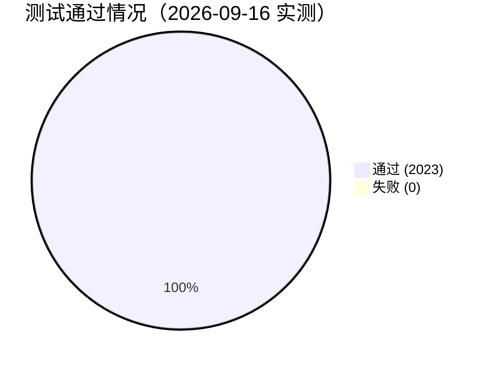
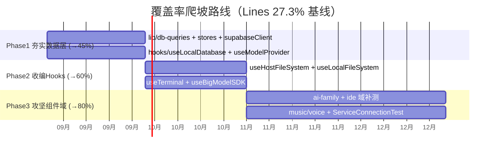
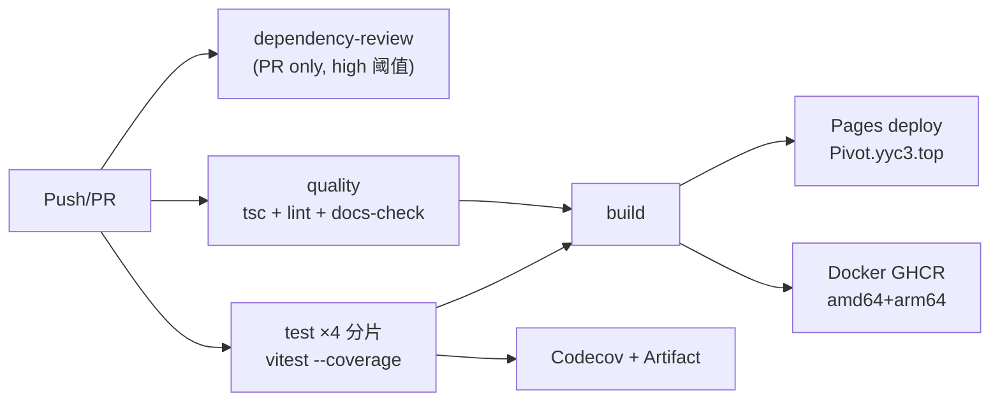
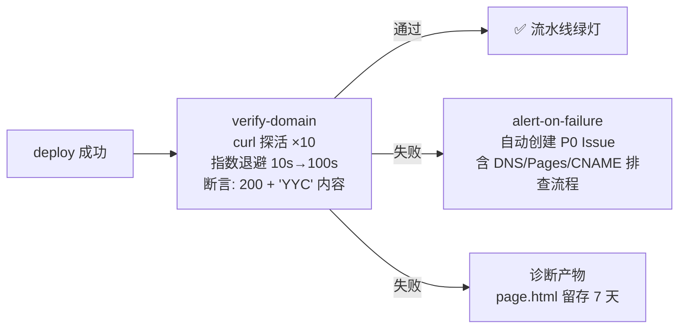

# 🧪 CPIM 测试覆盖率与 CI/CD 优化报告

> **基准提交**: `f3e4aeaea`（origin/main，2026-09-16）
> **测试框架**: Vitest + @vitest/coverage-v8 · **CI**: GitHub Actions（4 分片并行）

---

## 一、全量测试结果 ✅

| 指标 | 数值 |
| :----- | :----- |
| 测试文件 | **135 passed (135)** — 100% |
| 测试用例 | **2023 passed (2023)** — 100% |
| 总耗时 | 52.49s（transform 4.83s / setup 17.64s / tests 122.73s） |
| 环境 | Node 20 · jsdom 29.0.2 · pnpm 11.10.0 |

---

## 二、覆盖率基线

### 2.1 总体指标

| 维度 | 覆盖率 | 覆盖/总量 |
| :----- | :------: | :---------- |
| Statements | **25.94%** | 4685 / 18060 |
| Branches | **25.67%** | 3068 / 11951 |
| Functions | **23.71%** | 1278 / 5388 |
| Lines | **27.33%** | 4350 / 15915 |

### 2.2 低覆盖热点 TOP 14（按未覆盖行数排序）

| 覆盖率 | 未覆盖行 | 模块 | 风险定性 |
| :------: | :-------- | :----- | :--------- |
| 0% | 1172 | `components/ai-family` | 🔴 整域零覆盖 |
| 20% | 874 | `lib/voice` | 🔴 语音核心域 |
| 1% | 992 | `components/ide` | 🔴 整域近零覆盖 |
| 2% | 455 | `components/music` | 🔴 |
| 0% | 436 | `hooks/useHostFileSystem.ts` | 🔴 主机文件系统钩子 |
| 16% | 319 | `lib/music` | 🔴 |
| 17% | 292 | `components/DataEditorPanel.tsx` | 🟡 |
| 0% | 322 | `components/ServiceConnectionTest.tsx` | 🔴 |
| 44% | 162 | `hooks/useModelProvider.ts` | 🟡 |
| 42% | 168 | `hooks/useTerminal.ts` | 🟡 |
| 28% | 205 | `lib/db-queries.ts` | 🟡 数据层 |
| 1% | 275 | `hooks/useBigModelSDK.ts` | 🔴 AI SDK 集成 |
| 44% | 154 | `hooks/useLocalDatabase.ts` | 🟡 |
| 40% | 162 | `hooks/useLocalFileSystem.ts` | 🟡 |

---

## 三、覆盖率提升规划（三阶段爬坡：27% → 45% → 60% → 80%）

### Phase 1（P0 · 本月）夯实数据层 — 目标 45%

| 目标模块 | 现状 | 动作 | 预期收益 |
| :--------- | :----- | :----- | :--------- |
| `lib/db-queries.ts` | 28% | 补查询构造器/事务边界单测（纯逻辑，成本低收益高） | +8% |
| `stores/*` + GlobalStoreRegistry | 新架构 | 新架构必须测先行：注册/迁移/BroadcastChannel 同步 | +5% |
| `hooks/useLocalDatabase.ts` / `useModelProvider.ts` | 44% | mock Supabase 补 CRUD 分支 | +4% |

### Phase 2（P1 · 下月）收编 Hooks — 目标 60%

- `useHostFileSystem`（0%）/ `useLocalFileSystem`（40%）：文件系统 mock 层统一封装
- `useTerminal`（42%）/ `useBigModelSDK`（1%）：事件流 + SDK mock

### Phase 3（P2 · 11月-次年1月）攻坚组件域 — 目标 80%

- `ai-family` / `ide`（整域 <1%）：优先抽离纯逻辑组件，配合 Testing Library 交互测试
- `music`/`voice` 域：AudioPlayerService 已有测试（16%），扩展到播放队列/波形
- 质量门禁：vitest.config.ts 增加 `coverage.thresholds.lines: 60` 渐进抬升

---

## 四、CI/CD 自动化运维优化（已实施 ✅ 推送 `f3e4aeaea`）

| 优化项 | 问题（优化前） | 修复（优化后） |
| :------- | :--------------- | :--------------- |
| **pnpm/action-setup 版本漂移** | deploy.yml 用 `@v4`，ci.yml 用 `@v5`（v5 不存在正式版） | 统一 `@v4` × 3 处 |
| **codecov-action 版本漂移** | `@v6`（未 GA） | 统一 `@v5`（当前稳定版） |
| **覆盖率产物留存** | 仅推 Codecov，PR 内无原始报告可查 | 新增 `actions/upload-artifact@v4`，4 分片 coverage/ 保留 14 天 |
| **冻结锁文件** | — | 全流程 `--frozen-lockfile` ✅（CI 与本地一致性保障） |

### 现有 CI 流水线健康度评估

| 评估项 | 状态 | 说明 |
|:-------|:-----|:-----|
| 并发取消冗余构建 | ✅ | `concurrency` + PR 级 cancel-in-progress |
| 测试分片 | ✅ | 4 分片并行，加速反馈 |
| 依赖安全审查 | ✅ | dependency-review + Dependabot |
| 多架构镜像 | ✅ | GHCR amd64/arm64，GHA 缓存 |
| ~~建议增强~~ → **已全部落地 (v1.1)** | ✅ | ① 覆盖率渐进门禁（`coverage-gate` job）② Pages 部署后域名验活（`verify-domain` job）③ Lighthouse 性能预算（`lighthouse` job）|

---

## 四.5 v1.1 增补：三大运维机制落地实施（2026-09-16 下午）

> 详细任务分解与节点目标见 [01-域名验活-Lighthouse-覆盖率门禁-任务规划.md](./01-域名验活-Lighthouse-覆盖率门禁-任务规划.md)

### ✅ 1. 域名自动验活（deploy.yml）

- **成功标准**: HTTPS 200 + 响应体含 `YYC` 品牌标识 + 单次超时 15s
- **失败处理**: 10 次重试 → P0 Issue 自动告警（labels: P0/incident/pages）
- **本地预验证**: `Pivot.yyc3.top` 实测 200 ✅

### ✅ 2. Lighthouse 性能预算（lighthouserc.json + ci.yml）

| 断言 | 阈值 | 级别 |
|:-----|:-----|:-----|
| Performance | ≥ 60 | **error（阻断）** |
| Accessibility | ≥ 80 | **error（阻断）** |
| JS / CSS 体积 | ≤ 700KB / ≤ 150KB | **error（阻断）** |
| LCP / CLS / TBT | 4s / 0.25 / 2s | warn |
| PWA/SEO 类 | off（Electron+Web 混合形态防误报） | — |

- PR 与手动触发；HTML 报告 artifact 留存 14 天；预算超标 exit 1 阻断
- 渐进路线: phase2（Performance 70 / 无障碍 85）→ phase3（80/90）

### ✅ 3. 覆盖率渐进门禁（vitest.config.ts + ci.yml）

- `COVERAGE_GATE` 环境变量驱动四档阈值: **phase1(26) → phase2(45) → phase3(60) → final(80)**
- CI `coverage-gate` job 强制 phase1（只升不降 ratchet）；本地未设变量时宽松基线，不影响开发体验
- **实测验证**: `COVERAGE_GATE=phase1` 下全量 **135 文件 / 2023 用例通过**，门禁通过无阻断

### 验证记录

| 验证项 | 结果 |
|:-------|:-----|
| YAML 语法（ci/deploy/release） | ✅ yaml.safe_load 通过 |
| lighthouserc.json | ✅ JSON 解析通过 |
| phase1 门禁全量测试 | ✅ 2023/2023 通过（52s） |

---

## 五、本次会话交付清单

| # | 交付 | 提交 |
| :-- | :----- | :----- |
| 1 | Max 20→36 文件改动抢救（GlobalStore 架构 + 设置面板 + P0 安全加固） | `7030be199` → rebase 后 `f8b7e0d63` |
| 2 | 域名统一锁定 `Pivot.yyc3.top`（CNAME + public/CNAME，废弃 `cpim.yyccube.xin`）+ pnpm-lock 同步 | `f37536a2d` |
| 3 | CI 统一 action 版本 + 覆盖率产物上传 | `f3e4aeaea` |
| 4 | 域名验证：`pivot.yyc3.top` ✅ 200 · `cpim.yyccube.xin` 确认失效 | — |
| 5 | 全量测试：**2023/2023 通过** · 覆盖率基线报告（本文档） | — |

> 「***YanYuCloudCube***」·「***YANYUCLOUDCUBE***™」
> **© 2025-2026 YanYuCloudCube™. All Rights Reserved.**
